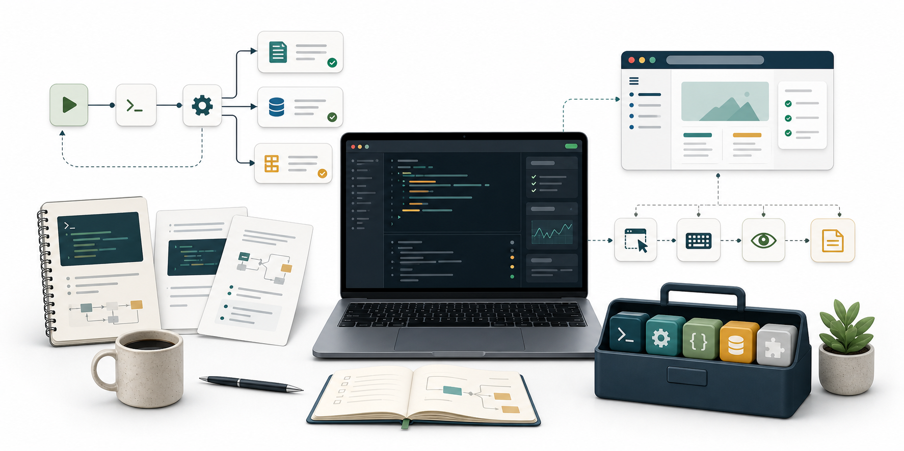

# Awesome Agent Skills

<p align="center">
  
</p>

Personal Codex skills for focused agent workflows.

PRs and feedback are welcome.

Welcome to the Awesome Agent Skills repo. This repository is a curated
collection of practical Codex skills designed for one primary purpose: making
repeatable agent workflows easier to start, maintain, and reuse across projects.

The repository is intentionally kept outside the default Codex skill loading
directory. It is a source repository for selected personal skills, not a copy of
Codex-managed system skills.

## Quickstart

### Installation

Copy the desired skill folder into `$CODEX_HOME/skills/`.

`$CODEX_HOME` defaults to `~/.codex`, so the default target directory is:

```text
~/.codex/skills/
```

Example:

```bash
cp -a ./harness-setup ~/.codex/skills/
```

Restart Codex so it loads the new skill.

In your next session, invoke the skill naturally by asking for the workflow it
supports. Some Codex surfaces may also support explicit skill invocation with a
`$` prefix.

## What Are Skills And How Are They Different From MCP Tools?

Skills are specialized instruction sets that guide the LLM on how to accomplish
specific tasks. You can think of a skill as a playbook with concrete inputs,
outputs, workflows, standards, and references.

A useful skill usually contains:

- Step-by-step workflows and procedures
- Code examples, document templates, or reusable assets
- Standards, formatting rules, and common pitfalls
- References, scripts, or snippets that help the agent complete the task

MCP tools are callable tools that let the LLM interact with external systems and
services. They extend what the LLM can do.

Skills extend how well the LLM can perform a specific kind of work.

In short:

- MCP tools extend capability.
- Skills extend expertise.

## Contents

- Relation among skills
- Skills
- Creating skills
- Contributing

## Relation Among Skills

The skills in this repository are independent. Each one targets a specific
agent workflow and can be installed separately.

Use only the skills you need. Do not copy Codex-managed `.system/` skills into
this repository.

## Skills

### `harness-setup`

Set up or clean up a project-area documentation harness while keeping the
repository-level `AGENTS.md` and `harness_management.md` unique at the project
root.

Use this when a project needs scoped documentation under an area such as:

- `evals/`
- `training/datapipe/`
- `training/grpo/`

The skill supports two modes:

- `init`: create a new harness structure for a user-specified directory
- `adopt`: clean up and standardize an existing messy or stale harness

### `computer-use-agent-job`

Guide a computer-use agent through job application workflows on ATS platforms.

Use this when the agent needs to operate browser-based job application systems,
inspect form state, fill required fields, handle platform-specific rules, and
record validation or failure notes.

The skill includes references for common ATS platforms and helper PowerShell
scripts for UI inspection and required-field scanning.

## Creating Skills

### Skill Structure

Each skill is a folder containing a required `SKILL.md` file with YAML
frontmatter:

```text
skill-name/
├── SKILL.md          # Required: skill instructions and metadata
├── scripts/          # Optional: helper scripts
├── templates/        # Optional: document templates
├── assets/           # Optional: reusable assets
└── references/       # Optional: reference files
```

### Basic Skill Template

```markdown
---
name: my-skill-name
description: A clear description of what this skill does and when to use it.
---

# My Skill Name

Detailed description of the skill's purpose and capabilities.

## When To Use This Skill

- Use case 1
- Use case 2
- Use case 3

## Instructions

[Detailed instructions for Codex on how to execute this skill.]

## Examples

[Real-world examples showing the skill in action.]
```

## Repository Notes

This repository currently lives at:

```text
/home/agent/Awesome_Agent_Skills
```

The default local Codex skill directory is:

```text
/home/agent/.codex/skills
```

To activate a skill from this repository, copy or symlink the selected skill
folder into the default local Codex skill directory.

## Contributing

PRs and feedback are welcome. When adding a new skill, follow the skill
structure above, keep the `description` field specific about when the skill
should be triggered, and test that the skill metadata stays concise enough to
fit comfortably in the context window.
